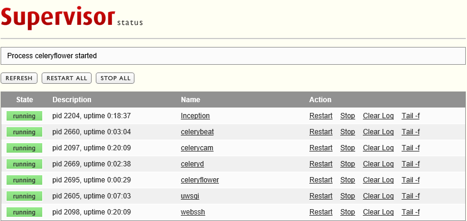
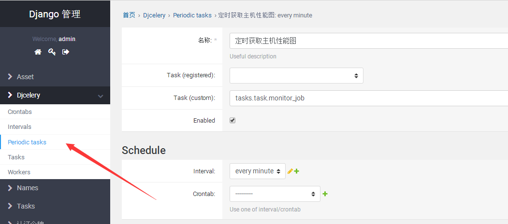
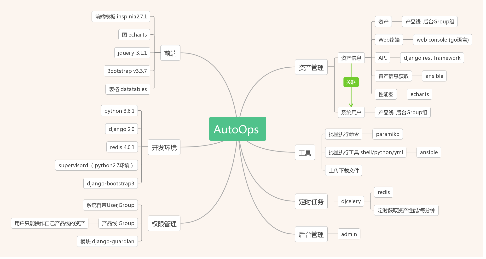
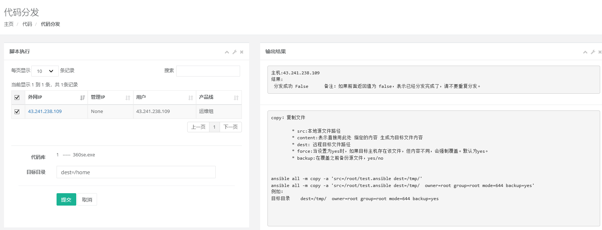
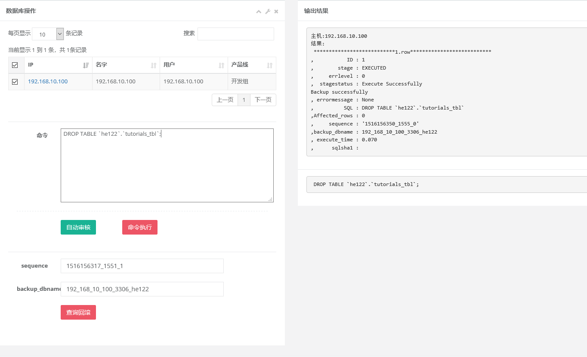
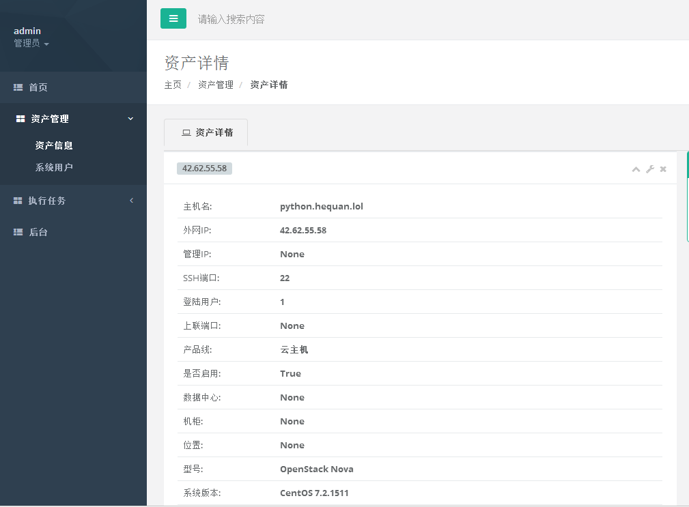
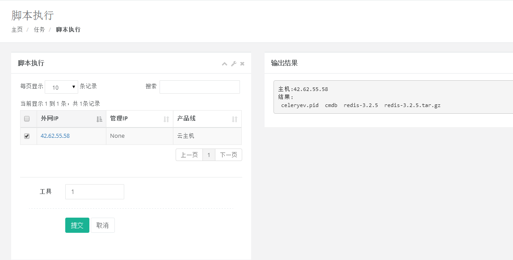
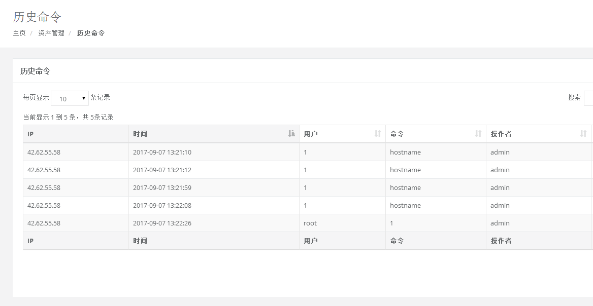
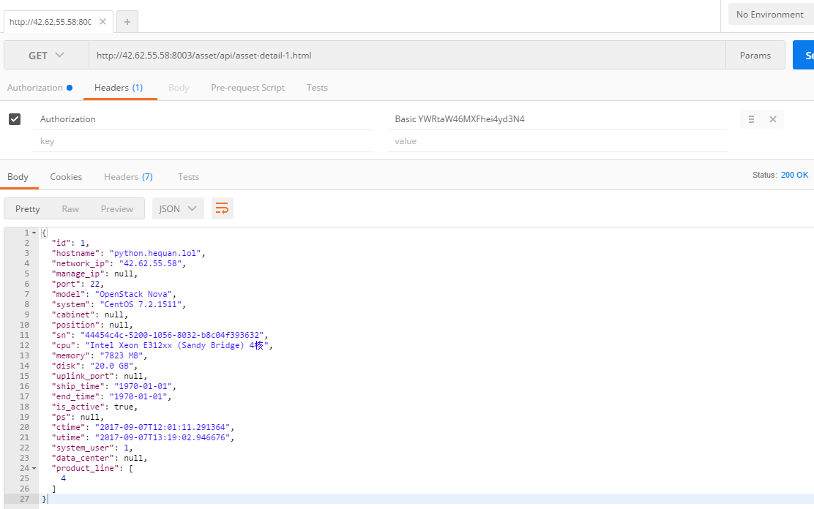

[简体中文](README.md) | [English](README.en.md)

# AutoOps

> 基于 Django 2.2 的 Linux 资产管理（CMDB）与运维管理平台，集成 WebSSH、批量命令执行、监控图表、Docker/K8s 管理、MySQL 在线审核与代码发布。


> **⚠️ 本项目已停止开发！** 因长时间未对代码进行维护，可能会造成项目在不同环境上无法部署、运行 BUG 等问题，请知晓。代码仅供学习参考，作者不再提供更新与维护。

## 项目介绍

AutoOps 是一个面向 Linux 运维工程师的一站式运维管理平台，把日常运维中最常用的几件事收进一个 Web 界面：资产管理（CMDB）、批量命令执行、服务器 CPU/内存/流量监控、WebSSH 免跳板登录、运维知识库、MySQL SQL 上线审核，以及 Docker 与 Kubernetes 的基本管理。

平台的权限体系基于 django-guardian 实现对象级授权：在后台按用户组（如运维组、开发组）划分资源后，组内账号只能看到本组的服务器与数据库，执行任务时也只能选择本组资产，无法越权添加或查看其他组的资源。

平台内置 Celery 定时任务（定时采集主机性能数据、清理历史监控记录）与 Supervisor 进程管理（统一拉起 uwsgi、webssh、celery、Inception 等组件），适合中小团队在 CentOS 环境搭建一套自用的运维管理平台。也欢迎作为 Django + Ansible + Celery 的综合学习项目阅读源码。

## ✨ 功能特性

- **资产管理（CMDB）**
  - 资产增删改查、详情查看，支持批量删除
  - 通过 Ansible 自动采集服务器信息（主机名、系统、IP、CPU、内存、磁盘、SN 等）
  - CPU / 内存 / 流量监控图表（pyecharts 渲染，含近 7 天历史）
  - 资产信息全部导出（Excel）、对外 REST API（DRF 实现资产列表/详情接口）
  - 系统用户管理（密码 Fernet 加密存储，`names/password_crypt.py`）
- **任务中心**
  - 命令行：Web 界面选择主机批量执行命令（Ansible API）
  - 工具：保存 Shell / Python 脚本片段，随时对主机批量分发执行
- **WebSSH**：浏览器直接 SSH 登录服务器（Tornado + Paramiko，参考 [huashengdun/webssh](https://github.com/huashengdun/webssh)），资产列表一键进入
- **数据库管理**：MySQL 实例与数据库账号信息管理，绑定产品线/数据中心
- **数据库操作平台（Inception）**
  - SQL 在线审核（基于 Inception，仅支持 MySQL）
  - 审核通过后一键执行，支持查询回滚语句
- **代码发布**
  - 代码库管理，上传代码包后通过 Ansible `copy` 模块分发到目标主机
- **Docker 管理**：容器列表展示（镜像、状态、端口映射、启动命令），支持启停/重启操作（Docker SDK）
- **K8s 管理**：集群资源概览，覆盖 Namespace / Node / Pod / Service / ConfigMap / Secret / Deployment / DaemonSet / StatefulSet / Job / CronJob
- **GPU 资源**：GPU 算力套餐浏览、下单购买、订单激活与用量记录
- **技术文档**：运维知识库，DjangoUeditor 富文本编辑器，问题记录不用再到处找
- **用户与审计**：平台登录记录、Web 操作记录、命令执行记录、密码修改
- **后台管理**：xadmin 后台（`/admin/`）+ Django 自带后台（`/dadmin/`），基于用户组的资源隔离，admin 拥有最高权限
- **定时任务**：Celery 定时采集主机 CPU/内存/流量，自动清理 1 周前历史监控记录

## 🛠 技术栈

| 类别 | 组件 |
| --- | --- |
| 后端 | Python 3.6、Django 2.2.28、djangorestframework、django-guardian、xadmin（django2 分支） |
| 任务调度 | Celery 3.1.25 + django-celery + Redis（Broker） |
| 自动化 | Ansible（>= 2.4.5，内置 `tasks/ansible_2420` API 封装）、Paramiko |
| 前端 | Bootstrap（django-bootstrap3）、pyecharts 图表、DjangoUeditor 富文本 |
| WebSSH | Tornado 6.3.3 + Paramiko + cryptography |
| 容器/集群 | docker（>= 6.1.3）、kubernetes（>= 29.0.0）Python 客户端 |
| 数据库审核 | Inception（内置二进制 `script/inception/`） |
| 存储 | SQLite（默认）/ MySQL（pymysql） |
| 部署 | uwsgi + Supervisor（Python 2.7 启动）、可选 Nginx |

## 🚀 快速开始

环境要求：CentOS 7.4、Python 3.6.4（安装脚本 `script/install_python3.6.4.sh`）、Python 2.7（用于启动 Supervisor）、Redis；Docker / Kubernetes 为可选（容器与集群管理用）。

### 1. 基础环境

```bash
cd /opt
yum install git sshpass redis -y
systemctl enable redis.service
systemctl start redis.service
git clone https://github.com/hequan2017/autoops.git
cd autoops/
pip3 install -r requirements.txt

# 安装 xadmin（django2 分支）
cd /usr/local/src
wget https://codeload.github.com/sshwsfc/xadmin/zip/django2
unzip django2
cd xadmin-django2/
python setup.py install
```

> 建议在被管理资产上执行 `yum install ipmitool dmidecode -y` 以采集更多信息。

### 2. 安装 Supervisor（Python 2.7）

```bash
chmod +x /opt/autoops/script/inception/bin/*
pip2 install supervisor    # 没有 pip2 可参考 script/install_pip2.sh
echo_supervisord_conf > /etc/supervisord.conf
mkdir /etc/supervisord.d/

# 编辑 /etc/supervisord.conf，追加：
[inet_http_server]             # Supervisor HTTP 管理界面账号密码
port=0.0.0.0:9001
username=user
password=321

[include]
files = /etc/supervisord.d/*.conf

cp /opt/autoops/script/supervisor.conf /etc/supervisord.d/
```

`supervisor.conf` 托管的进程：`uwsgi`（Web 服务，默认监听 `0.0.0.0:8003`）、`webssh`（端口 9000）、`celeryd` / `celerybeat` / `celerycam`（队列与定时任务）、`Inception`（SQL 审核）。

### 3. 配置 `autoops/settings.py`

```python
DATABASES = {
    'default': {
        'ENGINE': 'django.db.backends.sqlite3',   # 无 MySQL 时用 SQLite
        'NAME': os.path.join(BASE_DIR, 'db.sqlite3'),
    }
}
# 有 MySQL 时可切换：
# 'ENGINE': 'django.db.backends.mysql', 'NAME': 'autoops',
# 'USER': 'root', 'PASSWORD': '123456', 'HOST': '192.168.10.24', 'PORT': '3306'
# MySQL 安装方法可参考作者博客：http://hequan.blog.51cto.com/5701886/1982428

DEBUG = True                                   # 生产环境请改为 False

BROKER_URL = 'redis://127.0.0.1:6379/0'        # Redis 地址，一般不用改

Webssh_ip = '114.115.132.147'                  # WebSSH 访问 IP，改成本机外网 IP
Webssh_port = '9000'                           # 端口，修改后需同步修改 webssh/main.py

Inception_ip = '127.0.0.1'                     # Inception 地址，默认本机
Inception_port = '6669'

inception_remote_system_password = '654321'    # 回滚备份库参数，
inception_remote_system_user = 'root'          # 需同步修改 script/inc.cnf
inception_remote_backup_port = '3306'
inception_remote_backup_host = '192.168.10.100'
```

### 4. 兼容性补丁

```bash
# Django + MySQL 低版本兼容：注释
# /usr/local/lib/python3.6/site-packages/django/db/backends/mysql/base.py
# 中类似下面两行（找不到可忽略）：
# if version < (1, 3, 3):
#     raise ImproperlyConfigured("mysqlclient 1.3.3 or newer is required; ...")

# Inception 不原生支持 pymysql，用仓库内改好的文件直接替换：
cp /opt/autoops/script/connections.py /usr/local/lib/python3.6/site-packages/pymysql/connections.py
cp /opt/autoops/script/cursors.py    /usr/local/lib/python3.6/site-packages/pymysql/cursors.py
```

### 5. 初始化并启动

```bash
python manage.py makemigrations
python manage.py migrate
python manage.py createsuperuser      # 创建管理员

/usr/bin/python2.7 /usr/bin/supervisord -c /etc/supervisord.conf
# 可写入 /etc/rc.d/rc.local 实现开机启动（记得 chmod +x）
```

- 平台访问端口在 `script/supervisor.conf` 第 2 行，默认 `0.0.0.0:8003`
- Supervisor 管理界面：`0.0.0.0:9001`（账号 `user` / 密码 `321`），可启停 uwsgi、webssh、celery、Inception



- 登录后台后：设置定时任务获取主机性能图（先建执行频率，再建任务，观察队列是否执行成功，不成功就重启 celery 相关服务）、设置数据中心与用户组。



### 生产环境部署

用 Nginx 处理静态文件与 uwsgi 反代（可参考[作者博客](http://hequan.blog.51cto.com/5701886/1982769)），并删除 `supervisor.conf` 中 uwsgi 相关段落，改用下面的命令控制 uwsgi：

```bash
uwsgi --ini    /opt/autoops/script/uwsgi.ini     # 启动
uwsgi --stop   /opt/autoops/script/uwsgi.pid     # 关闭
uwsgi --reload /opt/autoops/script/uwsgi.pid     # 重载
```

Nginx 参考配置：

```nginx
root /opt/autoops;

location / {
    include uwsgi_params;
    uwsgi_connect_timeout 30;
    uwsgi_pass unix:/opt/autoops/script/uwsgi.sock;
}

location /static/ {
    alias /opt/autoops/static/;
    index index.html index.htm;
}
```

### Windows（PyCharm）本地调试

先 pip 安装好依赖（ansible 无法装在 Windows 上，忽略），然后注释以下文件中的 ansible 导入与调用代码，并注释 xadmin：

```text
asset/views.py、tasks/views.py、release/views.py 中的：
from tasks.ansible_2420.runner import AdHocRunner, CommandRunner
from tasks.ansible_2420.inventory import BaseInventory
```

## 📁 目录结构

```text
autoops/
├── asset/        # 资产管理（CMDB）：模型、API、性能图表、WebSSH 入口
├── db/           # 数据库管理：MySQL 实例与账号
├── names/        # 用户与审计：登录/Web/命令历史、密码加密
├── tasks/        # 任务中心：命令行、工具脚本、Inception SQL 审核
├── release/      # 代码发布：代码库管理与主机分发
├── library/      # 技术文档：运维知识库
├── dockerops/    # Docker 容器管理
├── k8sops/       # Kubernetes 集群概览
├── gpuops/       # GPU 资源：套餐、订单、分配
├── webssh/       # WebSSH 服务（Tornado + Paramiko）
├── DjangoUeditor/ # 富文本编辑器
├── script/       # 部署脚本：supervisor.conf、uwsgi.ini、Inception 及 pymysql 补丁
└── templates/    # 前端模板
```

## 🧭 架构图



## 📸 截图








## 🗺️ 更新记录

- **1.8** 最后一次更新：修改 ansible API 以支持 playbook（需自行测试）
- **1.7.8** 后台更换为 xadmin（xadmin 暂不支持 django-guardian 对象权限，需要时请登录 dadmin 的 admin 账号）
- **1.7.7** 更换 webssh 启动方式
- **1.7.6** 代码库功能上线，支持分发
- **1.7.4** 更新 ansible，增强命令行功能
- **1.6** MySQL 数据库自动审核 + 执行（仅限 MySQL）
- **1.4** 升级 Django 2.0
- **1.3** 新增技术文档模块
- **1.2** 权限管理完善 + 附件上传下载
- **1.1.5** 权限管理：基于用户组的资源隔离
- **1.1** 新增平台登录记录、Web 登录记录、密码修改

## 🌐 Demo & 社区

- 交流群号：`620176501`（欢迎交流）
- 博客：`http://hequan.blog.51cto.com/`
- GitHub：`https://github.com/hequan2017/autoops/`
- 码云：`https://gitee.com/hequan2020/autoops`

## 📄 License

[Apache License 2.0](LICENSE)

## 👥 贡献者

#### 1.0

- 何全
